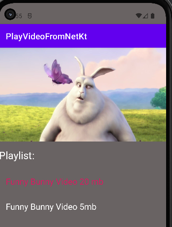
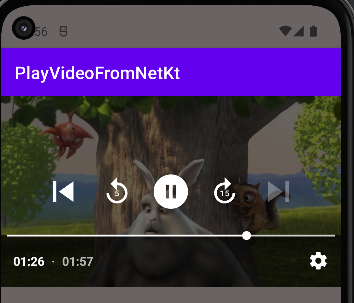

# PlayVideoFromNetKt


```kotlin
package andrzej.gac.playvideofromnetkt

import android.net.Uri
import android.os.Bundle
import androidx.activity.enableEdgeToEdge
import androidx.appcompat.app.AppCompatActivity
import androidx.core.view.ViewCompat
import androidx.core.view.WindowInsetsCompat
import androidx.media3.common.MediaItem
import androidx.media3.common.util.UnstableApi
import androidx.media3.datasource.DefaultDataSource
import androidx.media3.exoplayer.ExoPlayer
import androidx.media3.exoplayer.source.ProgressiveMediaSource
import androidx.media3.ui.PlayerView
import androidx.recyclerview.widget.LinearLayoutManager
import androidx.recyclerview.widget.RecyclerView


class MainActivity : AppCompatActivity() {

    private lateinit var tracks: List<Track>
    private lateinit var playerView: PlayerView
    private lateinit var rvTracks: RecyclerView
    private var player: ExoPlayer? = null
    private lateinit var dataSourceFactory: DefaultDataSource.Factory

    @UnstableApi
    override fun onCreate(savedInstanceState: Bundle?) {
        super.onCreate(savedInstanceState)
        enableEdgeToEdge()
        setContentView(R.layout.activity_main)

        ViewCompat.setOnApplyWindowInsetsListener(findViewById(R.id.main)) { v, insets ->
            val systemBars = insets.getInsets(WindowInsetsCompat.Type.systemBars())
            v.setPadding(systemBars.left, systemBars.top, systemBars.right, systemBars.bottom)
            insets
        }

        getArrayStreamList()

        playerView = findViewById(R.id.playerView)
        rvTracks = findViewById(R.id.rvTracks)

        rvTracks.layoutManager = LinearLayoutManager(this)
        rvTracks.adapter = TrackAdapter(tracks, ::changeTrack)

        setupExoPlayer()
    }

    private fun getArrayStreamList() {
        tracks = listOf(
            Track(
                "Funny Bunny Video 20 mb",
                "https://www.sample-videos.com/video321/mp4/720/big_buck_bunny_720p_20mb.mp4"
            ),
            Track(
                "Funny Bunny Video 5mb",
                "https://www.sample-videos.com/video321/mp4/720/big_buck_bunny_720p_5mb.mp4"
            )
        )
    }

    @UnstableApi
    private fun changeTrack(newTrack: Track) {
        player?.apply {
            stop()
            val newSource = ProgressiveMediaSource
                .Factory(dataSourceFactory)
                .createMediaSource(MediaItem.fromUri(Uri.parse(newTrack.url)))
            setMediaSource(newSource)
            prepare()
            play()
        }
    }

    @UnstableApi
    private fun setupExoPlayer() {
        if (player == null) {
            player = ExoPlayer.Builder(this).build().apply {
                playerView.player = this
            }
            dataSourceFactory = DefaultDataSource.Factory(this)
        }

        val url = tracks[0].url
        val videoSource = ProgressiveMediaSource
            .Factory(dataSourceFactory)
            .createMediaSource(MediaItem.fromUri(Uri.parse(url)))

        player?.apply {
            setMediaSource(videoSource)
            prepare()
        }
    }

    override fun onDestroy() {
        super.onDestroy()
        player?.release()
        player = null
    }

    override fun onResume() {
        super.onResume()
        player?.play()
    }

    override fun onPause() {
        super.onPause()
        player?.pause()
    }
}

```